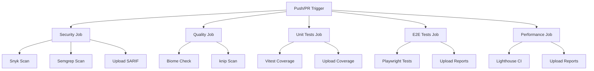
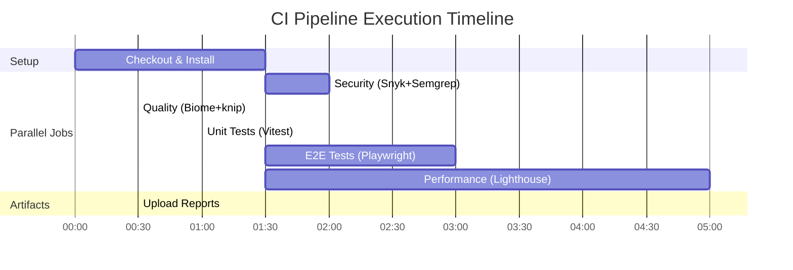

# GitHub Actions CI/CD Pipeline

Комплексная система непрерывной интеграции и развертывания для проекта AIFA v2.1, включающая 5 параллельных jobs для обеспечения качества кода, безопасности и производительности.

## 📊 Архитектура



## 🚀 Триггеры и условия

### Типы событий

| Событие | Условие | Запускаемые jobs |
|---------|---------|------------------|
| **push** | Ветки `main`, `develop` | Все 5 jobs |
| **pull_request** | PR в ветку `main` | Все 5 jobs |
| **draft PR** | PR в `main` со статусом draft | Все кроме Performance |

### Условия выполнения

```yaml
performance:
  if: github.event_name == 'push' || (github.event_name == 'pull_request' && !github.event.pull_request.draft)
```

**Обоснование**: Performance job пропускается на draft PR для экономии CI времени (~5-7 минут).

## 📋 Jobs детально

### 🔒 Security Job

**Назначение**: Сканирование зависимостей и кода на уязвимости

**Продолжительность**: ~2-3 минуты
**Таймаут**: 10 минут

**Примечание**: Дополнительно существует файл `.github/workflows/security.yml` (legacy), который запускается только по расписанию (ежедневно в 00:00 UTC) для периодических сканов. Основной security‑pipeline интегрирован в данный job.

**Шаги выполнения**:
1. Checkout кода
2. Setup Node.js 20.x с npm cache
3. Установка зависимостей: `npm ci`
4. Установка uv для Semgrep: `pipx install uv`
5. Запуск Snyk: `npm run snyk:test` (continue-on-error: true)
6. Генерация Snyk JSON: `npm run snyk:test:json`
7. Запуск Semgrep: `npm run semgrep:ci` (continue-on-error: true)
8. Генерация Semgrep SARIF: `npm run semgrep:sarif`
9. Upload SARIF в GitHub Security tab
10. Upload артефактов

**Инструменты**:
- **Snyk**: Сканирование зависимостей на известные уязвимости
- **Semgrep**: SAST (Static Application Security Testing) сканирование кода

**Артефакты**:
- `security-reports/` (30 дней)
  - `snyk-test-report.json`
  - `semgrep-report.json`
  - `semgrep.sarif`

**Пример вывода**:
```
Testing aifa-v2.1...
Organization:      aifa-agi
Package manager:   npm
Target file:       package.json
Project name:      aifa-v2.1
Docker image:      snyk/labs:latest

✓ Tested 1443 dependencies for known issues

Finding:  5 vulnerabilities (4 low, 1 moderate)
```

### ✨ Quality Job

**Назначение**: Проверка качества кода и выявление мертвого кода

**Продолжительность**: ~1-2 минуты
**Таймаут**: 10 минут
**Matrix**: Node.js 20.x, 22.x

**Шаги выполнения**:
1. Checkout кода
2. Setup Node.js (matrix version)
3. Установка зависимостей: `npm ci`
4. Запуск Biome: `npm run biome:ci`
5. Запуск knip: `npm run knip`
6. Генерация knip JSON: `npm run knip:report`
7. Upload артефактов

**Инструменты**:
- **Biome**: Форматирование и линтинг кода (строгий CI режим)
- **knip**: Выявление неиспользуемых файлов, экспортов, зависимостей

**Артефакты**:
- `quality-reports-node-20.x/`
- `quality-reports-node-22.x/`
- `knip-report.json` (14 дней)

**Пример вывода Biome**:
```
Checked 170 files in 1.2s
No errors found ✓
```

**Пример вывода knip**:
```
Unused files (34)
Unused dependencies (12)
Unused exports (8)
```

### 🧪 Unit Tests Job

**Назначение**: Выполнение unit тестов с измерением покрытия кода

**Продолжительность**: ~1-2 минуты
**Таймаут**: 10 минут
**Matrix**: Node.js 20.x, 22.x

**Шаги выполнения**:
1. Checkout кода
2. Setup Node.js (matrix version)
3. Установка зависимостей: `npm ci`
4. Запуск Vitest: `npm run test:coverage`
5. Upload coverage отчетов

**Конфигурация**:
- **Порог покрытия**: 80% (statements, branches, functions, lines)
- **Репортеры**: text, json, html, lcov
- **Охватываемые файлы**:
  - `lib/utils.ts`
  - `lib/themes.ts`
  - `lib/construct-metadata.ts`

**Артефакты**:
- `coverage-reports-node-20.x/`
- `coverage-reports-node-22.x/`
- `coverage/` (HTML, JSON, LCOV) (30 дней)

**Пример вывода**:
```
Test Files  3 passed (3)
Tests       15 passed (15)
Coverage    85.2% Stmts 83.1% Branches 80.5% Functions 84.7% Lines
```

### 🎭 E2E Tests Job

**Назначение**: End-to-end тестирование пользовательских сценариев

**Продолжительность**: ~4-5 минут
**Таймаут**: 15 минут
**Matrix**: Node.js 20.x, 22.x

**Шаги выполнения**:
1. Checkout кода
2. Setup Node.js (matrix version)
3. Установка зависимостей: `npm ci`
4. Получение версии Playwright
5. Кеширование Playwright browsers (~500MB)
6. Установка browsers (если нет в кеше)
7. Запуск Playwright: `npm run test:e2e`
8. Upload отчетов

**Конфигурация Playwright**:
- **Browsers**: Chromium, Firefox, Webkit, Mobile Chrome, No-JS
- **Retries**: 2 (в CI)
- **Workers**: 1 (в CI)
- **WebServer**: `npm run dev` (автозапуск)
- **Trace**: on-first-retry
- **Screenshots**: only-on-failure
- **Video**: retain-on-failure

**Кеширование**:
```yaml
key: playwright-${{ runner.os }}-${{ version }}
path: ~/.cache/ms-playwright
```

**Артефакты**:
- `playwright-report-node-20.x/`
- `playwright-report-node-22.x/`
- HTML отчет, screenshots, videos, traces (30 дней)

**Пример вывода**:
```
E2E Tests:
  ✓ parallel routes (chromium) - 15 tests
  ✓ intercepting modals (firefox) - 8 tests
  ✓ authentication (webkit) - 12 tests
  ✓ no-JS fallback (mobile-chrome) - 6 tests
```

### ⚡ Performance Job

**Назначение**: Аудит производительности и Core Web Vitals

**Продолжительность**: ~5-7 минут
**Таймаут**: 15 минут
**Условие**: Только на push или non-draft PR

**Важно**: Данный job настроен в **строгом режиме** — нарушения Lighthouse budgets приводят к неуспешному статусу job и блокируют merge при включённых branch protection rules.

**Шаги выполнения**:
1. Checkout кода
2. Setup Node.js 20.x
3. Установка зависимостей: `npm ci`
4. Запуск Lighthouse CI: `npm run lighthouse:ci` (строгая проверка)
5. Upload отчетов

**Lighthouse CI конфигурация**:
- **URL для аудита**: 8 страниц
  - Home: `http://localhost:3000/`
  - About: `http://localhost:3000/about-aifa`
  - Privacy: `http://localhost:3000/privacy-policy`
  - Hire-Me: `http://localhost:3000/hire-me`
  - Features: `http://localhost:3000/features`
  - Parallel Routing: `http://localhost:3000/features/parallel-routing`
  - Static Generation: `http://localhost:3000/features/static-generation`
  - Dynamic Generation: `http://localhost:3000/features/dynamic-generation`
- **Number of runs**: 3 (медианное значение)
- **Preset**: desktop
- **Throttling**: 4x CPU slowdown, 10 Mbps

**Performance Budgets**:

| Метрика | Бюджет | Статус |
|---------|--------|--------|
| Performance | ≥ 90 | ✅ |
| Accessibility | ≥ 95 | ✅ |
| Best Practices | ≥ 90 | ✅ |
| SEO | ≥ 95 | ✅ |
| PWA | ≥ 50 | ✅ |
| FCP | ≤ 1.8s | ✅ |
| LCP | ≤ 2.5s | ✅ |
| CLS | ≤ 0.1 | ✅ |
| TBT | ≤ 200ms | ✅ |
| Speed Index | ≤ 3.0s | ✅ |
| Total Byte Weight | ≤ 1 MB | ✅ |

**Артефакты**:
- `lighthouse-reports/`
- HTML и JSON отчеты (14 дней)

**Пример вывода**:
```
Lighthouse CI results:
http://localhost:3000/
  Performance: 92
  Accessibility: 97
  Best Practices: 95
  SEO: 98
  PWA: 65

http://localhost:3000/about-aifa/
  Performance: 90
  Accessibility: 96
  Best Practices: 95
  SEO: 97
  PWA: 65
```

## 💾 Кеширование

### npm Cache

```yaml
- uses: actions/setup-node@v4
  with:
    node-version: '20.x'
    cache: 'npm'
```

**Экономия**: ~30-60 секунд на установку зависимостей

### Playwright Browsers Cache

```yaml
- name: Cache Playwright browsers
  uses: actions/cache@v4
  with:
    path: ~/.cache/ms-playwright
    key: playwright-${{ runner.os }}-${{ steps.playwright-version.outputs.version }}
```

**Экономия**: ~2-3 минуты на установку browsers (~500MB)

## 🔀 Matrix Strategy

### Node.js версии

**Стратегия**: Тестирование на двух версиях Node.js

- **Node.js 20.x** (LTS) — основная версия
- **Node.js 22.x** (Latest) — проверка совместимости

**Обоснование**:
- Гарантия работы на современных и LTS версиях
- Раннее выявление проблем совместимости
- Проверка корректности кода на разных версиях

### Jobs с Matrix

| Job | Matrix версии | Время выполнения |
|-----|---------------|------------------|
| Quality | 20.x, 22.x | ~2-4 минуты |
| Unit Tests | 20.x, 22.x | ~2-4 минуты |
| E2E Tests | 20.x, 22.x | ~8-10 минут |

## 📦 Артефакты

### Список артефактов

| Артефакт | Путь | Retention | Описание |
|----------|------|-----------|----------|
| security-reports | snyk-test-report.json<br>semgrep-report.json<br>semgrep.sarif | 30 дней | Отчеты безопасности |
| quality-reports-node-* | knip-report.json | 14 дней | Отчеты качества кода |
| coverage-reports-node-* | coverage/ | 30 дней | Покрытие кода (HTML/JSON/LCOV) |
| playwright-report-node-* | playwright-report/ | 30 дней | E2E отчеты, скриншоты, видео |
| lighthouse-reports | .lighthouseci/ | 14 дней | Отчеты производительности |

### Скачивание артефактов

1. Перейти в GitHub Actions → Workflow run
2. Кликнуть на конкретный job
3. В секции "Artifacts" нажать "download"
4. Или использовать GitHub CLI:
   ```bash
   gh run download <run-id>
   ```

## 🔗 Интеграция с GitHub

### Security Tab

**SARIF Upload**: Автоматически загружает результаты Semgrep

**Просмотр**:
- GitHub → Security → Code scanning alerts
- Фильтр по tool: Semgrep

**Пример**:
```
Semgrep • 12 Code scanning alerts
[MEDIUM] Hardcoded credentials
lib/config.ts:45
```

### Checks Tab

**Статусы jobs**:
- ✅ Security (passing/failed)
- ✅ Quality (passing/failed)
- ✅ Unit Tests (passing/failed)
- ✅ E2E Tests (passing/failed)
- ✅ Performance (passing/failed/skipped)

**Детали**:
- Время выполнения
- Логи выполнения
- Артефакты для скачивания

## 🏠 Локальная репликация

### Быстрая проверка

```bash
# Запуск всех проверок локально
npm ci
npm run biome:ci
npm run knip
npm run test:coverage
npm run test:e2e
npm run lighthouse:ci
```

### Пошаговая проверка

```bash
# 1. Установка зависимостей
npm ci

# 2. Проверка качества кода
npm run biome:check

# 3. Поиск мертвого кода
npm run knip

# 4. Unit тесты
npm run test:run

# 5. E2E тесты
npm run test:e2e

# 6. Performance аудит
npm run lighthouse
```

### Скрипт для воспроизведения CI

**Файл**: `scripts/ci-local.sh`

```bash
#!/bin/bash
set -e

echo "🔄 Starting local CI simulation..."

# Install dependencies
echo "📦 Installing dependencies..."
npm ci

# Quality checks
echo "✨ Running quality checks..."
npm run biome:ci
npm run knip

# Unit tests
echo "🧪 Running unit tests..."
npm run test:coverage

# E2E tests
echo "🎭 Running E2E tests..."
npm run test:e2e

# Performance
echo "⚡ Running performance audit..."
npm run lighthouse:ci

echo "✅ Local CI completed successfully!"
```

## ⚡ Оптимизация

### Параллельные Jobs

**Преимущества**:
- Все 5 jobs выполняются одновременно
- Общее время: ~5-7 минут (vs ~20-27 минут последовательно)
- Экономия: ~15-20 минут

**Диаграмма выполнения**:



### Время выполнения

| Этап | Без оптимизации | С оптимизацией | Экономия |
|------|-----------------|----------------|----------|
| Setup | 3 мин | 1.5 мин | 1.5 мин |
| Security | 3 мин | 1.5 мин | 1.5 мин |
| Quality | 2 мин | 1 мин | 1 мин |
| Unit Tests | 2 мин | 1 мин | 1 мин |
| E2E Tests | 6 мин | 3 мин | 3 мин |
| Performance | 7 мин | 5 мин | 2 мин |
| **Total** | **23 мин** | **13 мин** | **10 мин** |

### Кеширование

**npm cache**:
- Автоматически кеширует `node_modules`
- Инвалидируется при изменении `package-lock.json`

**Playwright browsers cache**:
- Кеш: `~/.cache/ms-playwright`
- Размер: ~500MB
- Инвалидируется при изменении версии Playwright

## 🔧 Troubleshooting

### Частые ошибки

#### 1. Security Job: "SNYK_TOKEN not found"

**Ошибка**:
```
Error: SNYK_TOKEN environment variable is not set
```

**Решение**:
1. Получить токен: https://snyk.io/account
2. GitHub → Settings → Secrets and variables → Actions
3. New repository secret: `SNYK_TOKEN`
4. Вставить токен

#### 2. E2E Tests: "Browser not found"

**Ошибка**:
```
Error: Executable doesn't exist at /ms-playwright/chromium-xxx/chrome-linux/chrome
```

**Решение**:
```yaml
- name: Install Playwright browsers
  run: npx playwright install --with-deps
```

#### 3. Performance Job: "Port 3000 already in use"

**Ошибка**:
```
Error: Port 3000 is already in use
```

**Решение**:
```bash
# Убить процесс на порту 3000
lsof -ti:3000 | xargs kill -9

# Или изменить порт в playwright.config.ts
webServer: {
  command: 'npm run dev -- --port 3001',
  url: 'http://localhost:3001',
}
```

#### 4. Coverage threshold not met

**Ошибка**:
```
FAIL  Coverage (80%) is below threshold (85%)
```

**Решение**:
- Добавить тесты для непокрытых строк
- Изменить порог в `vitest.config.ts`:
  ```typescript
  thresholds: {
    statements: 80,  // Уменьшить с 85 до 80
    branches: 80,
    functions: 80,
    lines: 80
  }
  ```

#### 5. Lighthouse CI timeout

**Ошибка**:
```
Error: Lighthouse CI timeout after 120s
```

**Решение**:
Увеличить timeout в `lighthouserc.json`:
```json
{
  "ci": {
    "collect": {
      "timeout": 300000
    }
  }
}
```

### Дебагging failed jobs

#### 1. Просмотр логов

```bash
# GitHub CLI
gh run view <run-id> --log

# Веб-интерфейс
https://github.com/[owner]/[repo]/actions/runs/<run-id>
```

#### 2. Локальное воспроизведение

```bash
# Скопировать логи job
# Запустить локально
npm ci
npm run [команда из логов]
```

#### 3. Интерактивный дебаг

```yaml
# Добавить в workflow для debugging
- name: Debug
  run: |
    echo "Node version: $(node --version)"
    echo "NPM version: $(npm --version)"
    echo "Working directory: $(pwd)"
    ls -la
  env:
    DEBUG: true
```

### Контакты для поддержки

- **Security issues**: security@aifa.dev
- **CI/CD issues**: Create GitHub Issue
- **Performance issues**: Create GitHub Issue с label `performance`

## 🛡️ GitHub Settings

### Branch Protection Rules

**Рекомендуемые настройки** (Settings → Branches → Branch protection rules):

1. **Branch name pattern**: `main`

2. **Require a pull request before merging**
   - ✅ Require approvals: 1
   - ✅ Dismiss stale reviews
   - ✅ Require review from code owners

3. **Require status checks to pass before merging**
   - ✅ Require branches to be up to date before merging
   - Required checks:
     - `security`
     - `quality (20.x)`
     - `quality (22.x)`
     - `unit-tests (20.x)`
     - `unit-tests (22.x)`
     - `e2e-tests (20.x)`
     - `e2e-tests (22.x)`
     - `performance` (optional)

4. **Require conversation resolution before merging**

5. **Include administrators**

### Secrets & Variables

**GitHub Secrets** (Settings → Secrets and variables → Actions):

| Secret | Описание | Обязательно |
|--------|----------|-------------|
| `SNYK_TOKEN` | Snyk API token для сканирования | ✅ Да |
| `CODECOV_TOKEN` | Codecov token для coverage | ❌ Нет |

**GitHub Variables**:

| Variable | Значение | Описание |
|----------|----------|----------|
| `NODE_VERSION` | `20.x` | Default Node.js version |

#### Получение SNYK_TOKEN

1. Зарегистрироваться: https://snyk.io
2. Account Settings → General → Auth Token
3. Скопировать token
4. GitHub → Settings → Secrets → New repository secret
5. Name: `SNYK_TOKEN`, Value: [token]

## 🚀 Roadmap

### Фаза 1: Основной CI/CD (текущая)
- ✅ 5 параллельных jobs
- ✅ Кеширование
- ✅ Артефакты
- ✅ Matrix testing

### Фаза 2: Deployment Automation
- [ ] Deploy to Vercel on merge to main
- [ ] Preview deployments for PRs
- [ ] Environment-specific deployments (staging, production)

### Фаза 3: Release Automation
- [ ] Auto-versioning (semantic-release)
- [ ] Auto-changelog generation
- [ ] GitHub Releases

### Фаза 4: Advanced Monitoring
- [ ] Slack/Discord notifications
- [ ] Performance regression detection
- [ ] Security alerts integration

## 📚 Дополнительные ресурсы

### Документация
- **[BIOME.md](./BIOME.md)** — Biome linter/formatter
- **[VITEST.md](./VITEST.md)** — Unit тесты
- **[PLAYWRIGHT.md](./PLAYWRIGHT.md)** — E2E тесты
- **[LIGHTHOUSE.md](./LIGHTHOUSE.md)** — Performance аудиты
- **[SEMGREP.md](./SEMGREP.md)** — Security сканирование
- **[LEFTHOOK.md](./LEFTHOOK.md)** — Git hooks
- **[RENOVATE.md](./RENOVATE.md)** — Dependency updates

### Внешние ресурсы
- [GitHub Actions Documentation](https://docs.github.com/en/actions)
- [Node.js Release Schedule](https://nodejs.org/en/about/releases/)
- [Playwright CI Guide](https://playwright.dev/docs/ci/)
- [Lighthouse CI](https://github.com/GoogleChrome/lighthouse-ci)
- [Snyk CI Integration](https://docs.snyk.io/integrations/ci-cd-integrations)

## 🎓 Заключение

Данный CI/CD pipeline обеспечивает:
- **Автоматическую проверку** качества кода
- **Раннее выявление** проблем безопасности
- **Контроль покрытия** тестами (80%+)
- **Мониторинг производительности** Core Web Vitals
- **Масштабируемость** через matrix testing
- **Прозрачность** через артефакты и логи

Пайплайн оптимизирован для скорости выполнения (13 минут vs 23 минуты) и минимизирует время обратной связи для разработчиков.