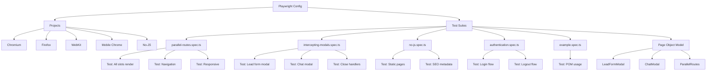

# E2E Test Architecture

## Test Architecture Diagram



## Test Coverage Matrix

| Feature | Test File | Browsers | Priority |
|---------|-----------|----------|----------|
| Parallel routes | `parallel-routes.spec.ts` | chromium, firefox, webkit, mobile | 🔴 High |
| Lead form modal | `intercepting-modals.spec.ts` | chromium, firefox, webkit | 🔴 High |
| Chat modal | `intercepting-modals.spec.ts` | chromium, firefox, webkit | 🔴 High |
| No-JS pages | `no-js.spec.ts` | no-js | 🔴 High |
| Authentication | `authentication.spec.ts` | chromium, firefox, webkit | 🟡 Medium |
| Responsive layout | `parallel-routes.spec.ts` | mobile | 🟡 Medium |
| SEO metadata | `no-js.spec.ts` | no-js | 🟢 Low |

## File Structure

```
e2e/
├── .gitignore              # Git ignore for test artifacts
├── README.md               # Quick start guide
├── ARCHITECTURE.md         # This file
├── example.spec.ts         # Example tests with POM
├── parallel-routes.spec.ts # Tests for parallel routes
├── intercepting-modals.spec.ts # Tests for modal interceptions
├── no-js.spec.ts           # Tests for no-JS scenarios
├── authentication.spec.ts  # Tests for auth flow
└── fixtures/
    ├── .gitignore          # Git ignore for fixtures
    ├── index.ts            # Barrel export
    └── pages.ts            # Page Object Model classes
```

## Key Components

### Playwright Configuration
- **File**: `playwright.config.ts`
- **Purpose**: Configure test runner, browsers, and dev server
- **Key Features**:
  - 5 browser projects (Chromium, Firefox, WebKit, Mobile, No-JS)
  - Automatic dev server startup
  - HTML/JSON reporters
  - Trace/screenshot/video on failure

### Test Suites
1. **parallel-routes.spec.ts**
   - Tests simultaneous rendering of all three slots
   - Tests navigation with slot persistence
   - Tests responsive layout

2. **intercepting-modals.spec.ts**
   - Tests lead form modal (open, fill, submit, success, close)
   - Tests chat modal (open, interact, close)
   - Tests keyboard shortcuts (Escape)
   - Tests overlay click handling

3. **no-js.spec.ts**
   - Tests static pages render without JavaScript
   - Tests server-side navigation
   - Tests SEO metadata

4. **authentication.spec.ts**
   - Tests login flow
   - Tests logout flow
   - Tests @rightDynamic overlay

5. **example.spec.ts**
   - Demonstrates Page Object Model usage
   - Shows best practices

### Page Object Model
- **Location**: `fixtures/pages.ts`
- **Classes**:
  - `LeadFormModal` - Encapsulates lead form modal interactions
  - `ChatModal` - Encapsulates chat modal interactions
  - `ParallelRoutes` - Encapsulates parallel routes checks

## Running Tests

### Development
```bash
# UI mode (recommended)
npm run test:e2e:ui

# Headed mode
npm run test:e2e:headed

# Debug mode
npm run test:e2e:debug
```

### CI/CD
```bash
# All tests across all browsers
npm run test:e2e

# Specific browser
npm run test:e2e:chromium
npm run test:e2e:firefox
npm run test:e2e:webkit

# Mobile viewport
npm run test:e2e:mobile

# No-JavaScript
npm run test:e2e:no-js
```

## Reports

After test execution:
- **HTML Report**: `playwright-report/index.html`
- **JSON Report**: `playwright-report/results.json`
- **Screenshots**: `test-results/` (on failure)
- **Videos**: `test-results/` (on failure)
- **Traces**: `test-results/` (on retry)

View report:
```bash
npm run test:e2e:report
```

## Best Practices

1. **Use Page Object Model**
   - Encapsulate element interactions
   - Improve test readability
   - Reduce code duplication

2. **Wait for Elements**
   - Use `expect().toBeVisible()`
   - Use `waitForSelector()`
   - Avoid arbitrary `sleep()`

3. **Test Across Browsers**
   - Chromium (Chrome/Edge)
   - Firefox
   - WebKit (Safari)

4. **Test Responsive Layouts**
   - Desktop (default viewport)
   - Mobile (Pixel 5)

5. **Test No-JS Scenarios**
   - Verify static pages work
   - Check SEO metadata
   - Ensure progressive enhancement

6. **Use Semantic Selectors**
   - Prefer `text=` selectors
   - Use accessible roles
   - Avoid brittle CSS classes

7. **Keep Tests Isolated**
   - No shared state
   - Clean up after tests
   - Use unique data

8. **Debug Effectively**
   - Use UI mode for development
   - Use `--headed` for visual debugging
   - Use `--debug` for step-by-step
   - Check traces/screenshots on failure

## Troubleshooting

### Dev Server Issues
- Check if port 3000 is available
- Verify `npm run dev` starts successfully
- Increase `timeout` in config if needed

### Element Not Found
- Verify selector exists
- Check if element is visible
- Use Playwright Inspector
- Add explicit waits

### Timeout Errors
- Increase timeout in config
- Check network requests
- Verify page load
- Use `--headed` mode

### No-JS Tests Failing
- Ensure pages are server-rendered
- Check no client-side dependencies
- Verify static content

### Mobile Tests Failing
- Check viewport settings
- Verify responsive classes
- Test on actual device if needed
